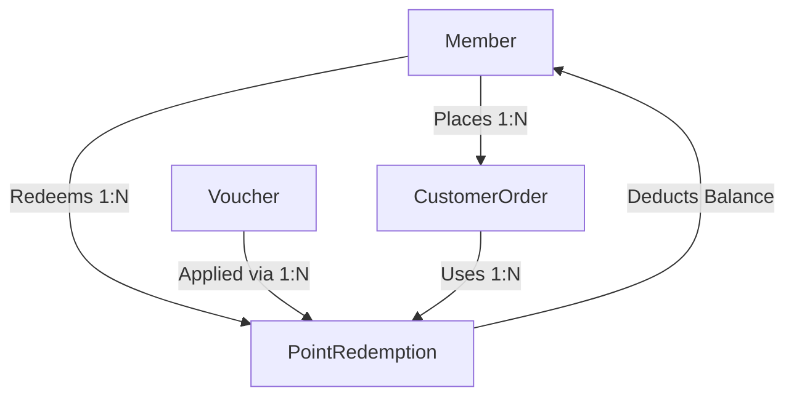

# Developer Mental Model: Module 1 — Member & Loyalty Management

## 1. Domain Overview & Architecture
The **Member & Loyalty Management** module drives customer retention, lifetime value (LTV) maximization, and engagement in 88 Speedmart. It governs:
- **Membership Lifecycles**: Normal (Lifetime Free) vs. VIP (Annual Fee RM12.00/yr).
- **Loyalty Currency**: Earn 1 point per RM1.00 spent on completed orders; points expire after 12 months.
- **Voucher & Point Redemption**: Converting accumulated points into discount or delivery vouchers during checkout.
- **Inactivity Defense**: Auto-transitioning inactive accounts (>12 months of inactivity) to 'Inactive'.



---

## 2. Component Design & Rubric Mapping

### A. Task 8: Extra Efforts (Sequences, Indexes, Views)
- **Sequence `seq_member_id`**: Provides sequential, collision-free IDs starting from 1000 for member registration.
- **Index `idx_member_status_type` & `idx_redemption_member_order`**: Optimizes multi-table analytical joins and member lookup during frequent checkout and redemption cycles.
- **Views**:
  - `v_member_loyalty_summary`: Strategic view calculating aggregated metrics: lifetime spend, order count, point redemptions, and months since last transaction.
  - `v_voucher_utilization`: Tactical view aggregating voucher redemptions, total points consumed, and completion conversion rates.

### B. Task 4: Analytical Queries
1. **Strategic Churn Matrix (Query 1)**: Categorizes members into risk bands (Active, Tactical Re-engage, High Churn Risk) based on order recency and lifetime spend.
2. **Tactical Voucher ROI (Query 2)**: Quantifies points burn rate and conversion efficiency across campaign tiers.

### C. Task 5: Stored Procedures & Exceptions
1. **`sp_register_or_renew_member`**:
   - Validates email structure, duplicate emails, and membership types.
   - Automatically computes a 12-month expiry date for VIP members.
   - Employs `e_invalid_email`, `e_invalid_type`, and `RAISE_APPLICATION_ERROR(-20001)`.
2. **`sp_process_point_redemption`**:
   - Enforces business rules: active status check, pending order verification, voucher validity & balance deduction.
   - Catches Oracle FK constraint violations via `PRAGMA EXCEPTION_INIT(e_foreign_key_violation, -2291)`.
   - Uses custom exceptions `e_insufficient_points`, `e_inactive_member`, `e_voucher_invalid`.

### D. Task 6: Conditional Triggers
1. **`trg_guard_point_redemption`** (`BEFORE INSERT ... WHEN (NEW.PointUsed > 0)`):
   - Row-level guard ensuring no inactive member can redeem points, and the member's current point balance is strictly greater than or equal to `:NEW.PointUsed`.
2. **`trg_enforce_vip_expiration`** (`BEFORE UPDATE OF MembershipType ... WHEN (NEW.MembershipType = 'VIP')`):
   - Automatically calculates and sets the 1-year expiration timestamp whenever a member upgrades to VIP tier.

### E. Task 7: Nested Cursor Reports
1. **`rpt_member_annual_statement(p_member_id)`**:
   - **Parent Cursor**: Retrieves member profile and point balance.
   - **Nested Child Cursor 1**: Iterates through complete order history, order items, and expenditure totals.
   - **Nested Child Cursor 2**: Iterates through historical point redemptions and claimed vouchers.
2. **`rpt_voucher_performance_summary`**:
   - **Parent Cursor**: Iterates through active voucher catalog.
   - **Nested Child Cursor**: Iterates through individual customer redemptions and associated retail branches.

---

## 3. Sample Execution & Verification

```sql
-- 1. Execute Procedures
VARIABLE v_new_id NUMBER;
EXEC sp_register_or_renew_member('Sarah Connor', 'sarah.c@sky.net', 'hashedpwd123', '012-3456789', 'VIP', '12 Jalan Cyber, KL', :v_new_id);

VARIABLE v_redemp_id NUMBER;
EXEC sp_process_point_redemption(1, 1, 1, :v_redemp_id);

-- 2. Execute Reports
EXEC rpt_member_annual_statement(1);
EXEC rpt_voucher_performance_summary;
```
