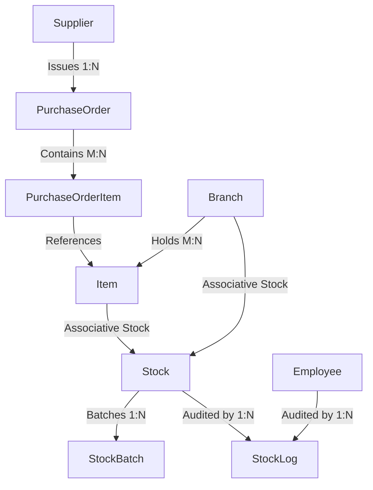

# Developer Mental Model: Module 2 — Inventory & Purchasing Management

## 1. Domain Overview & Architecture
The **Inventory & Purchasing Management** module underpins the supply chain of 88 Speedmart. It manages:
- **Multi-Branch Inventory**: Tracking stock quantity, reorder levels, shelf locations, and storage ceilings per branch.
- **Batch & Spoilage Tracking**: Tracking batch receipts and expiry dates (`StockBatch`) to mitigate perishables risk.
- **Procurement Lifecycles**: Managing supplier Purchase Orders (`PurchaseOrder`, `PurchaseOrderItem`) and inventory intake upon verification.
- **Stock Write-offs & Audit Trail**: Logging all inventory variances (Damaged, Expired, Restock) in `StockLog` with employee association.



---

## 2. Component Design & Rubric Mapping

### A. Task 8: Extra Efforts (Sequences, Indexes, Views)
- **Sequences**: `seq_po_id` (for Purchase Orders) and `seq_stock_log_id` (for audit entries).
- **Performance Indexes**:
  - `idx_stock_branch_reorder`: Accelerates reorder-alert polling across nationwide retail branches.
  - `idx_batch_item_expiry`: Speeds up expiration risk scanning across warehouse batches.
- **Views**:
  - `v_branch_inventory_health`: Strategic view showing total inventory valuation, active items, and count of low-stock alerts per branch.
  - `v_supplier_procurement_summary`: Tactical view aggregating purchase order fulfillment rates and cumulative spend per supplier.

### B. Task 4: Analytical Queries
1. **Strategic Stock Replenishment Forecast (Query 1)**: Identifies all stock items below safe reorder thresholds, computes suggested restocking amounts up to `MaximumStock`, and estimates required capital expenditure.
2. **Tactical Batch Spoilage Analysis (Query 2)**: Identifies near-expiry batches (<90 days remaining) and quantifies financial inventory at risk.

### C. Task 5: Stored Procedures & Exceptions
1. **`sp_receive_purchase_order`**:
   - Validates PO status (`Approved` or `Pending`) and verifies receiving employee's active status and branch assignment.
   - Upserts branch stock using `MERGE`, creates new `StockBatch` entries, and writes audit records to `StockLog`.
   - Employs `e_po_not_approved`, `e_employee_unauthorized`, `e_empty_po`, and `RAISE_APPLICATION_ERROR`.
2. **`sp_adjust_damaged_stock`**:
   - Reduces stock quantity and inserts negative adjustment log into `StockLog`.
   - Bounds Oracle Check Constraint violations (-2290) via `PRAGMA EXCEPTION_INIT(e_check_constraint_violated, -2290)`.
   - Custom validation on negative numbers and stock underflows (`e_insufficient_stock`).

### D. Task 6: Conditional Triggers
1. **`trg_guard_po_item_integrity`** (`BEFORE INSERT OR UPDATE ... WHEN (NEW.Quantity <= 0 OR NEW.CostPrice <= 0)`):
   - Enforces positive quantities and unit cost prices at database level.
2. **`trg_guard_maximum_stock_capacity`** (`BEFORE UPDATE OF Quantity ... WHEN (NEW.Quantity > OLD.MaximumStock)`):
   - Enforces branch physical warehouse ceiling constraints before committing updates.

### E. Task 7: Nested Cursor Reports
1. **`rpt_branch_inventory_audit(p_branch_id)`**:
   - **Parent Cursor**: Branch location details.
   - **Child Cursor 1**: Complete inventory listing with reorder threshold alerts.
   - **Child Cursor 2**: Most recent stock adjustments and staff audit logs.
2. **`rpt_supplier_procurement_audit(p_supplier_id)`**:
   - **Parent Cursor**: Supplier profile.
   - **Child Cursor 1**: Purchase Order headers.
   - **Child Cursor 2 (Nested)**: PO line items, unit costs, and subtotal calculations.

---

## 3. Sample Execution & Verification

```sql
-- 1. Execute Procedures
EXEC sp_receive_purchase_order(1, 7, 1);
EXEC sp_adjust_damaged_stock(1, 1, 7, 2, 'Damaged', 'Broken glass during unpacking');

-- 2. Execute Reports
EXEC rpt_branch_inventory_audit(1);
EXEC rpt_supplier_procurement_audit(1);
```
