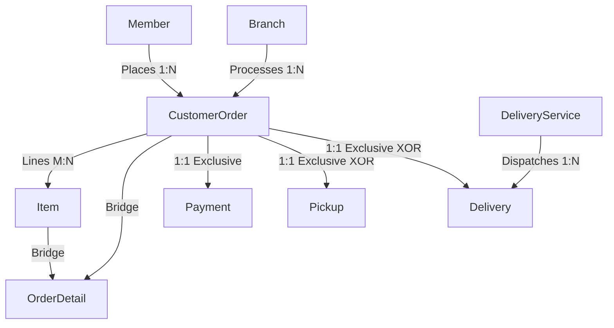

# Developer Mental Model: Module 3 — Order, Payment & Fulfillment Management

## 1. Domain Overview & Architecture
The **Order, Payment & Fulfillment Management** module orchestrates the core commercial transaction flow of 88 Speedmart:
- **Order Placement**: Linking member purchases across retail branches with line-item detail (`CustomerOrder`, `OrderDetail`).
- **Mutual Fulfillment Exclusivity**: Enforcing strictly one fulfillment route per order—either **In-Store Pickup** (`Pickup`) with a 6-digit claim code or **Third-Party Delivery** (`Delivery`, `DeliveryService`).
- **Payment Settlement & Loyalty Accrual**: Handling multi-channel payment records (`Payment`) and awarding 1 loyalty point per RM 1.00 spent upon successful payment settlement.



---

## 2. Component Design & Rubric Mapping

### A. Task 8: Extra Efforts (Sequences, Indexes, Views)
- **Sequences**: `seq_order_id` and `seq_payment_id` for high-throughput order and invoice generation.
- **Performance Indexes**:
  - `idx_order_date_status`: Optimizes high-volume reporting by branch and date.
  - `idx_payment_method_stat`: Accelerates financial reconciliation by payment gateway.
- **Views**:
  - `v_order_fulfillment_summary`: Strategic view consolidating customer orders, items total, fulfillment classification, and payment states.
  - `v_courier_delivery_efficiency`: Tactical view tracking 3rd-party logistics provider fulfillment ratios and freight revenues.

### B. Task 4: Analytical Queries
1. **Strategic Omnichannel Sales (Query 1)**: Assesses revenue split between delivery and pickup orders across retail locations.
2. **Tactical Courier SLA (Query 2)**: Quantifies courier completion rates, in-transit backlog, and delivery revenue.

### C. Task 5: Stored Procedures & Exceptions
1. **`sp_create_pickup_order`**:
   - Generates random 6-digit pickup verification code and creates order header and pickup record atomically.
   - Handles exceptions for invalid members/branches (`e_inactive_customer`, `e_inactive_branch`).
2. **`sp_settle_order_payment`**:
   - Validates payment channels, settles balance, marks order `Completed`, and updates customer loyalty points.
   - Binds Oracle Unique Constraint violation (-1) via `PRAGMA EXCEPTION_INIT(e_duplicate_transaction, -1)` to prevent duplicate payment transaction keys.
   - Handles `e_order_not_pending`, `e_invalid_amount`, `e_invalid_method`.

### D. Task 6: Conditional Triggers
1. **`trg_guard_exclusive_delivery`** (`BEFORE INSERT ON Delivery`):
   - Validates that no matching `Pickup` record exists for the given order before creating a delivery assignment, enforcing strict mutual exclusivity.
2. **`trg_guard_paid_payment_state`** (`BEFORE UPDATE ... WHEN (OLD.PaymentStatus = 'Paid' AND NEW.PaymentStatus = 'Pending')`):
   - Prohibits reversing settled payments back to pending state.

### E. Task 7: Nested Cursor Reports
1. **`rpt_order_tax_invoice(p_order_id)`**:
   - **Parent Cursor**: Detailed order, customer profile, fulfillment route, and payment metadata.
   - **Child Cursor (Nested)**: Line items with individual discounts, unit prices, and net payable calculations.
2. **`rpt_branch_daily_manifest(p_branch_id)`**:
   - **Parent Cursor**: Branch profile.
   - **Child Cursor 1**: In-store pickup claim queue with verification codes.
   - **Child Cursor 2**: Outbound courier dispatches with courier tracking numbers.

---

## 3. Sample Execution & Verification

```sql
-- 1. Execute Procedures
VARIABLE v_new_ord NUMBER;
VARIABLE v_code VARCHAR2(10);
EXEC sp_create_pickup_order(1, 1, :v_new_ord, :v_code);

EXEC sp_settle_order_payment(1, 'E-Wallet', 150.00, 'TXN-EW-992011');

-- 2. Execute Reports
EXEC rpt_order_tax_invoice(1);
EXEC rpt_branch_daily_manifest(1);
```
