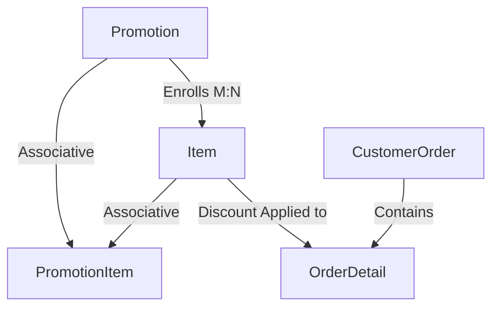

# Developer Mental Model: Module 4 — Promotion & Marketing Management

## 1. Domain Overview & Architecture
The **Promotion & Marketing Management** module powers retail campaigns, item-level discounts, and price reductions across 88 Speedmart:
- **Campaign Definition**: Setting promotional periods and monetary discount amounts per item (`Promotion`).
- **Product Enrollment**: Associating items with promotional campaigns via associative entity `PromotionItem`.
- **Dynamic Price Reductions**: Adjusting checkout item discounts (`OrderDetail.Discount`) to deliver savings to customers while tracking absorbed margin costs.



---

## 2. Component Design & Rubric Mapping

### A. Task 8: Extra Efforts (Sequences, Indexes, Views)
- **Sequence**: `seq_promo_id` for new campaign generation.
- **Performance Indexes**:
  - `idx_promo_date_range`: Speeds up temporal queries filtering active promotional windows.
  - `idx_promo_item_lookup`: Accelerates item discount lookups during checkout cart calculations.
- **Views**:
  - `v_active_promotion_catalog`: Strategic view displaying active promotions, original vs promotional prices, and percentage markdown.
  - `v_promotion_sales_performance`: Tactical view tracking units sold, revenue generated, and total discount value absorbed per campaign.

### B. Task 4: Analytical Queries
1. **Strategic Promotion Revenue & Margin Absorption (Query 1)**: Categorizes marketing campaigns into performance tiers (High Performing, Moderate Uplift, Low Conversion) based on sales yield.
2. **Tactical Markdown Depth Analysis (Query 2)**: Identifies top discounted products and remaining campaign days.

### C. Task 5: Stored Procedures & Exceptions
1. **`sp_create_promotional_campaign`**:
   - Validates that `EndDate > StartDate`, discount is positive, and discount does not exceed base retail price.
   - Enrolls the item into the promotion.
   - Handles `e_invalid_dates`, `e_negative_discount`, `e_item_unavailable`, `RAISE_APPLICATION_ERROR`.
2. **`sp_apply_order_promo_discount`**:
   - Updates order lines for pending orders with current active promotional discounts.
   - Binds Oracle Numeric Overflow (-1438) via `PRAGMA EXCEPTION_INIT(e_numeric_overflow, -1438)`.
   - Handles `e_order_not_pending`.

### D. Task 6: Conditional Triggers
1. **`trg_guard_promotion_date_range`** (`BEFORE INSERT OR UPDATE ... WHEN (NEW.EndDate <= NEW.StartDate)`):
   - Rejects campaigns with invalid chronological dates at database level.
2. **`trg_guard_promo_item_discount`** (`BEFORE INSERT ON PromotionItem`):
   - Ensures promotional discount amounts cannot exceed or equal the base price of the item.

### E. Task 7: Nested Cursor Reports
1. **`rpt_active_promotions_catalog`**:
   - **Parent Cursor**: Active campaign headers with valid date ranges and discount amounts.
   - **Child Cursor (Nested)**: Enrolled grocery products, original prices, and markdown prices.
2. **`rpt_promotion_sales_audit(p_promo_id)`**:
   - **Parent Cursor**: Promotion campaign metadata.
   - **Child Cursor (Nested)**: Customer orders that purchased promoted items with total discount savings.

---

## 3. Sample Execution & Verification

```sql
-- 1. Execute Procedures
VARIABLE v_new_promo NUMBER;
EXEC sp_create_promotional_campaign(2.50, SYSDATE, SYSDATE + 14, 1, :v_new_promo);

EXEC sp_apply_order_promo_discount(1);

-- 2. Execute Reports
EXEC rpt_active_promotions_catalog;
EXEC rpt_promotion_sales_audit(1);
```
