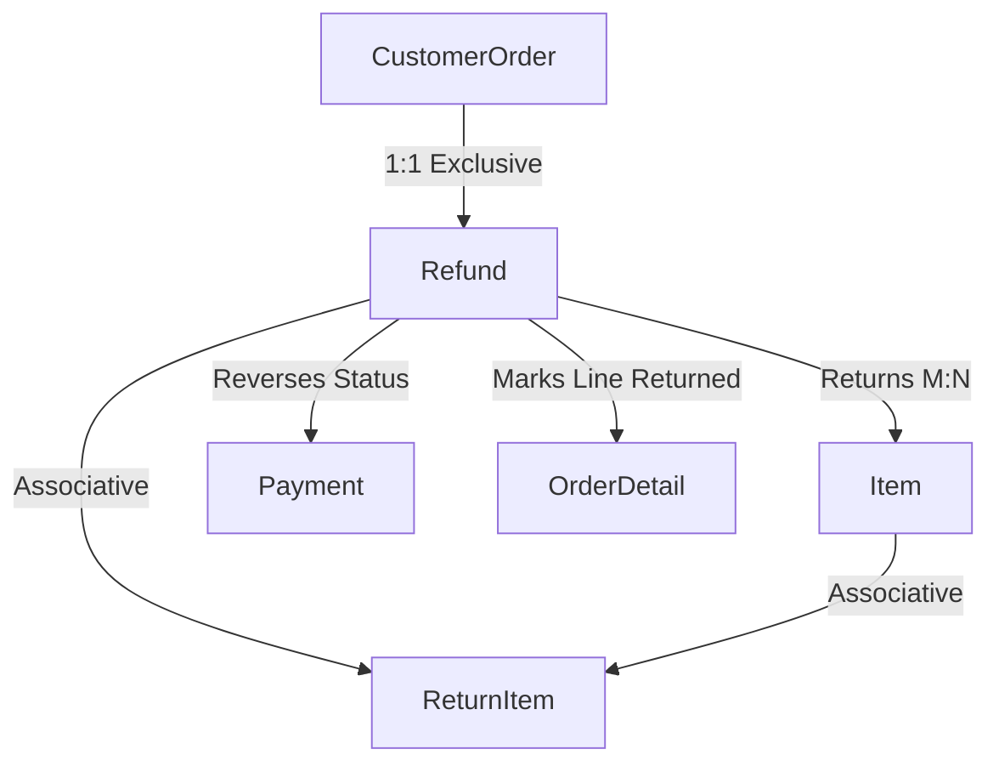

# Developer Mental Model: Module 5 — Refund & Return Management (Selected Extra Module)

## 1. Domain Overview & Architecture
The **Refund & Return Management** module handles customer return claims and quality write-offs for 88 Speedmart:
- **Claim Submission**: Filing claims against completed orders within a strict 7-day post-purchase window (Rule 31).
- **Condition Validation**: Ensuring only legitimately flawed goods (`'Damaged'`, `'Defective'`, or `'Expired'`) are accepted for refund (Rule 33).
- **Adjudication & Financial Reversal**: Managerial approval or rejection, automatically updating `Payment.PaymentStatus` to `'Refunded'` (Rule 32) and marking item line status to `'Returned'`.



---

## 2. Component Design & Rubric Mapping

### A. Task 8: Extra Efforts (Sequences, Indexes, Views)
- **Sequence**: `seq_refund_id` for refund ticket allocation.
- **Performance Indexes**:
  - `idx_refund_order_stat`: Speeds up order dispute checks and claim adjudication queries.
  - `idx_returnitem_lookup`: Accelerates return item lookup by condition for quality control metrics.
- **Views**:
  - `v_refund_claim_summary`: Strategic view combining customer details, branch origin, photo evidence, and returned item quantities.
  - `v_defective_item_loss`: Tactical view aggregating financial losses by product to identify troublesome suppliers or damaged batches.

### B. Task 4: Analytical Queries
1. **Strategic Quality Defect Loss Ranking (Query 1)**: Identifies top products causing customer claims and triggers supplier audit recommendations.
2. **Tactical Branch Refund Risk Monitoring (Query 2)**: Quantifies refund claim frequencies and approval ratios across nationwide retail branches.

### C. Task 5: Stored Procedures & Exceptions
1. **`sp_submit_refund_claim`**:
   - Enforces 7-day claim window, verifies completed order status, validates item defect condition, and calculates refund payout amount.
   - Handles `e_order_not_completed`, `e_exceeded_7_days`, `e_invalid_condition`, `e_existing_refund`, `RAISE_APPLICATION_ERROR`.
2. **`sp_adjudicate_refund`**:
   - Updates claim status to `'Approved'` or `'Rejected'`.
   - On approval, cascades status updates to `Payment` (`'Refunded'`) and `OrderDetail` (`'Returned'`).
   - Binds Oracle Check Constraint violation (-2290) via `PRAGMA EXCEPTION_INIT(e_check_constraint, -2290)`.
   - Handles `e_invalid_decision`, `e_claim_not_pending`.

### D. Task 6: Conditional Triggers
1. **`trg_guard_return_item_condition`** (`BEFORE INSERT OR UPDATE ... WHEN (NEW.ItemCondition NOT IN ('Damaged', 'Defective', 'Expired'))`):
   - Enforces Rule 33 directly at database level, preventing non-defective returns.
2. **`trg_guard_refund_amount_limit`** (`BEFORE INSERT OR UPDATE ON Refund`):
   - Validates that the requested refund payout cannot exceed the net amount paid for the order.

### E. Task 7: Nested Cursor Reports
1. **`rpt_refund_claim_dossier(p_refund_id)`**:
   - **Parent Cursor**: Customer, order, lodging date, and evidence photo metadata.
   - **Child Cursor (Nested)**: Individual returned item lines, damage condition, unit costs, and staff remarks.
2. **`rpt_branch_quality_audit(p_branch_id)`**:
   - **Parent Cursor**: Branch location details.
   - **Child Cursor (Nested)**: Approved refund incidents with customer names and refund values.
   - **Grandchild Cursor (Nested)**: Defective items returned under each incident.

---

## 3. Sample Execution & Verification

```sql
-- 1. Execute Procedures
VARIABLE v_new_ref NUMBER;
EXEC sp_submit_refund_claim(1, 'Milk was sour and curdled', 'Drop-off at Branch', 'http://img.freshmart/proof01.jpg', 1, 2, 'Expired', :v_new_ref);

EXEC sp_adjudicate_refund(1, 'Approved', 'Verified expired batch; refund approved.');

-- 2. Execute Reports
EXEC rpt_refund_claim_dossier(1);
EXEC rpt_branch_quality_audit(1);
```
